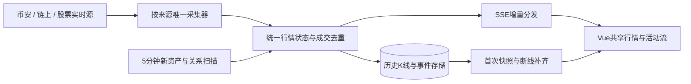

# 数据采集、行情推送与动态页面专项审查

日期：2026-09-17。代码基线：3ddccdb。目标：股票与 Meme 行情真正更新，页面持续显示真实新成交和新事件，同时受控使用 API 额度。

本次为现状调研与解决方案，没有修改采集配置、业务代码或部署，没有购买数据服务。检查了当前源码、部署进程、两套后台响应、公开域名 SSE、有限上游权限探测。四个关键 Python 文件的线上/本地 SHA-256 一致。

## 结论

当前问题不仅是频率慢。重构后存在“采集器获得的数据未进入页面”“成交刷新入口永远不执行”“没有首页事件推送”“两套采集器共用账本但各自计数”等断层。

先打通数据链路并修复正确性，再扩大实时覆盖。纯粹增加轮询或动画会扩大额度消耗，并可能让错误报价变得更显眼。

## 一、线上观测

约北京时间 11:00 的有限观测，非全天 SLA：

| 指标 | Python :8010 | Node :3456 |
|---|---:|---:|
| 候选资产数 | 644 | 644 |
| 股票资产版本记录数 | 2,490 | 2,538 |
| 有代币价格的股票版本记录 | 2,481 | 2,481 |
| 有 stockPrice 参考股价的版本记录 | **0** | **356** |
| 有 provider 字段的股票记录 | **0** | 2,538 |
| 有 updatedAt 字段的股票记录 | **0** | 2,538 |

以上是资产版本记录数，不是独立上市公司数量。Node 中的参考报价不等于实时报价，部分已经过时。公开域名响应同样缺失股票来源字段；不能将页面价格都有值解释成真实股价已接好。

Python 候选资产价格字段的时间分布：

| 链 | 数量 | 中位价格时间距观测时刻 | 2 分钟内 | 超过 1 小时 |
|---|---:|---:|---:|---:|
| X Layer | 207 | 162.4 分钟 | 34 | 121 |
| BSC | 246 | 40.5 分钟 | 38 | 111 |
| Robinhood Chain | 191 | 14.3 分钟 | 41 | 0 |

这些是 fieldTimes.price 的年龄，不足以单独判定上游停更；需要与采集接收时间、最后成交时间、交易时段一起判断。但不能统一标为实时。

对本机 Python SSE 与公开域名 `/dashboard/api/stream` 同时观测约 28.8 秒：各收到 hello 1 条、heartbeat 1 条，未收到 price/trade。探测读超时设为 15 秒，短于服务心跳间隔，因此超时本身不是服务断线证据。同期公开快照价格变化 0 项、价格字段时间变化 5 项、股票代币价和参考股价变化均为 0。该短观测不能证明全天没有推送；结合源码可以定位其覆盖缺陷。

进程：`memedashboard`（Node）与 `pyradar`（Python）同时 online，工作目录均为 `/opt/memedashboard`。

EODHD：配置每天 100 个符号额度，快照 eodUsage.symbols=100，状态 stale，错误分类确认是本地每日符号上限到达。并非只要继续等待下一轮就会继续报价。

OKX 当前 Key 再次实测：登录 code=0，价格频道订阅返回 60036，明确提示需要有效 Market API subscription。

## 二、具体问题与修复方案

### P0-1：按需成交与关注价格入口不执行

文件：`server-py/app/api/token.py:21`、`:26`；`collectors/trades.py`；`collectors/live_quotes.py`。

链参数声明为 `str`，却用 `if chain == 196`。合法请求得到的是字符串 "196"，条件恒假。唯一对应入口不触发 `refresh_asset_on_demand()`，也不会登记 watch_asset。即使后台每 15 秒执行 watchedPrice，关注列表仍可能为空。

修复：链类型统一；将交易采集与关注登记改成 `(chain, address)`，扩展三链；显式订阅当前查看资产，加入用户共享的去重队列、超时释放和并发锁。不要只改成 "196" 就认定全部链已实时。

### P0-2：股票展示未使用实际报价汇总

文件：`server-py/app/state.py`、`collectors/binance.py`、`web/src/stores/dashboard.js`。

Python state.reload 直接读 research store 的 stock 目录。币安推送只更新模块自己的 `_live` 和 `state['tokens']`，未写入该目录，也未广播行情；Python 汇总没有加入 Robinhood 最新报价或 Node 的 EODHD/enrichment 结果。即使币安推送连接成功，用户也未必看到它。

修复：统一 QuoteStore，由 instrumentId + venue + quoteType 唯一识别。目录只负责身份，报价独立维护。Python dashboard、详情、SSE 必须从同一个行情状态构建；将来源、上游时间、接收时间、行情性质一并输出。新增 stock-quote 事件，前端同时更新 stockTokens 与对应资产；目前 applyPrice 只更新 candidate assets。

### P0-3：重复采集与额度账本不可靠

文件：`src/server.ts:475` 之后、`server-py/app/main.py`、两套 okx_client、两套 Binance snapshot。

两套进程均有 liveQuotes、sideQuotes、Binance、关系采集等任务。都指向同一个 `data/okx-usage.json`，但日计数各自在内存维护，最后写入覆盖另一方，不能代表账户总消耗；共享数据库 facts 也可能发生旧数据最后写入。两套 Binance 还共用 JSON 快照路径。

修复：每类来源明确唯一采集所有者。迁移期 Node 仍承担 Python 尚未接回的股票目录/参考价/补充行情等能力，**不能直接停掉 Node**。先列所有权表、把缺失输出接入统一状态，再逐项关闭重复任务。最终收敛一个任务调度器、一个请求配额管理器；多实例用进程间锁或事务计数。

### P0-4：Python 轮次额度从未重置

文件：`server-py/app/okx_client.py:119`、`:134`，`collectors/main_round.py`，`api/candles.py`。

`reset_round()` 只有定义，没有调用。非 skip_round 请求累计到 70 次后，会持续被本地拦截；价格批次跳过轮次上限，K 线和成交却受限。可能出现“价格偶尔动，图表/成交不更新”。当前日志短窗口未证实已触发，但代码路径确定存在。

修复：将扫描轮次额度限定到扫描任务上下文，K 线与成交使用独立交互预算，共享全局日/月/速率限制。不要由一个全局 round 计数器卡住所有交互请求，也不要简单删除全局限制。

### P0-5：现有关注资产估价公式会制造错误波动

文件：`collectors/live_quotes.py:220` 至 `:237`。

计算 price=base.price × 当前池比率/基准池比率，但计算后只更新基准储备量、不更新 base.price。纯数值复现：锚价 10、基准比率 2；比率涨到 4 时算 20；下一次比率仍为 4 却算回 10。

该路径目前可能被 P0-1 遮挡；不能先放开入口再把错误估价当实时成交价写库。

修复：暂不将该估价混入主成交价。优先采用真实成交推送；需要池价时，按协议适配 V2/V3、用 ABI 正确解码、处理 decimals、计价币美元价、区块与池身份。池估价用独立 quoteType/source，不能冒充 OKX 最新成交。只补 base.price 仍不足以解决股票侧美元价格变化的问题。

### P1-1：价格采集范围与用户正在查看的资产无关

文件：`collectors/live_quotes.py:74`、`:129`。

X Layer 90 秒任务只更新有关联/篮子的 candidate，排除了 stock；普通热门 Meme 不一定覆盖。另两条链每 300 秒交替处理 100 项，同一链约 10 分钟再轮到，资产多时完整覆盖更慢。串行执行时间还会延长周期。

miss 达到 3 的 X Layer 项没有明确到期恢复；sideQuotes 检查 chain:token，但 `_cool()` 存 token，冷却键不一致。

修复：优先级按“当前详情 → 自选/可见列表 → 活跃资产 → 后台发现”，三链统一；冷却有期限和探活，使用链+合约。把尝试时间与上游行情时间分开，避免只按旧行情时间排队导致冷门资产反复占名额。

### P1-2：页面仍没有完整的实时状态合并

文件：`web/src/composables/useStream.js:61`、`stores/dashboard.js`、`views/DetailView.vue:196`。

SSE 只识别 price/trade；只按 token 匹配，忽略 chain；不更新股票报价列表；首页不消费成交。详情按格式化后的美元字符串判断是否赋值，微小但真实的价格变动可能被舍弃。20 秒全量快照可能覆盖刚到的更晚推送。

修复：按 instrumentId/chain+address+venue 定位，先合并原始数值，再根据显示值决定闪烁；按 marketAt/sequence 防止倒退；股票、详情、列表共享对象。补充连接状态、最后消息时间、最后成交时间、数据延迟。hello/heartbeat 只更新连接状态，不刷新行情时间。

### P1-3：没有持续进入首页的事件流

文件：`stream_hub.py`、`collectors/main_round.py`、`views/LiveView.vue`、`views/EventsView.vue`。

关系发现只落库，未推送 relationship 事件；首页从快照读取少量历史 signals。EventsView 主要依靠首次加载和手动按钮。现有 SSE 成交仅传给正在打开的详情，首页没有滚动成交流。

修复：真实关系创建/状态变化写库后发事件，成交写库去重后发事件；首页添加或改造为可切换的“最新成交 / 新配对 / 重要变化”区域，优先股票关联资产，另提供明确标注的全市场范围。关系发现低频是正常的，用成交流承担持续活动展示，不能把同一关系重复包装成新线索。

### P1-4：K 线缓存与主价格错误拼接

文件：`api/candles.py`、`components/CandleChart.vue:100`。

后端 5m K 线缓存 120 秒、1H 缓存 600 秒、1D 缓存 7200 秒；这是整个响应的 TTL，会让未收盘柱和成交量也冻结。前端直接将 asset.price 写到返回的最后一根柱的 c/h/l，未检查该柱是否已收盘、是否属于当前周期、来源是否一致，因此可能篡改历史柱。

修复：已收盘历史长期缓存；未收盘柱通过同源 candle/trade 推送更新。只有满足同市场、同周期、事件落在桶内才聚合。其他来源最新价最多作为独立标注的价格线。不根据一次价格快照伪造 OHLCV；0 成交量保持 0，不转换成 null。断网时读取已存历史并标旧，不能只返回 502。

### P1-5：连接可活着，但消息已丢

文件：`stream_hub.py`、`api/stream.py`、前端 connectStream。

没有 event ID/重放游标。客户端队列满时从广播集合移除，但 HTTP 连接可能继续发心跳；前端会误以为仍在接收行情。断开固定 5 秒重连，没有补事件协议。

修复：价格按资产合并最新值，成交/关系用有序持久事件；满队列发 resync 或显式关闭，重连带游标并补缺。SSE 保留即可，不必为了名称改成浏览器 WebSocket。

### P1-6：观测数据缺失

`state.payload()` 将 sources、quality、capabilities 写成空数组/空对象，collection 只有更新时间。用户无法知道是额度不足、源断线还是市场休市。

修复：每个来源输出状态、最近成功/失败、最近行情、当日日/月预算、更新覆盖数、错误类别；内部监控再加入推送延迟、队列长度、断线次数、丢弃/补齐数。公开页面以简短“实时/定时/延迟/休市/连接异常”呈现，不把内部错误堆满首屏。

## 三、数据源选择与现实边界

1. **币安场内资产**：沿用已有 WebSocket，打通状态与前端即可。按成交或 ticker 更新，历史图使用同交易对行情。miniTicker 不是逐笔成交；成交动态要另订阅 trade/aggTrade 并使用其真实事件字段。[Binance 官方文档](https://developers.binance.com/en/docs/catalog/core-trading-spot-trading/api/ws-streams/~)。
2. **链上 Meme、股票代币**：优先 OKX Market WebSocket 价格/成交/K线频道，REST 仅用于历史和补缺。本次当前 Key 仍无权限。官方 Free 无 WS，Starter 99 美元/月支持全部频道，实际覆盖和订阅并发需按账户验证。[OKX 计费](https://web3.okx.com/onchainos/dev-docs/market/market-api-fee)。
3. **真实股票**：先恢复现有参考价展示，再接 EODHD 或对应市场有权使用的实时 feed。当前 `/api/real-time` 的 Live Delayed 股票数据不能当作秒级。官方 WS 覆盖和权限与 REST 不同，港股等市场不能默认由美股推送解决。网站对外展示时需核实对应套餐的数据展示权限。[EODHD 官方说明](https://eodhd.com/financial-apis/new-real-time-data-api-websockets)。
4. **不新增付费时**：币安可以真正推送；其他资产采用预算内定时更新，优先关注资产。也可对有限已验证池订阅 RPC Swap 等事件，但要完成协议解码、美元换算、重组和断线回补，不能把当前简化储备比公式直接推广。

不承诺所有冷门资产每秒变价。目标是上游出现真实新行情时及时展示；股票休市、没有新成交时价格合理静止。

## 四、推荐的最终链路

统一消息字段建议：eventId、sequence、type、instrumentId、chainId、address、venue、source、quoteType、marketAt、receivedAt、payload、quality。

quoteType 区分真实股票成交、场内股票代币成交、DEX 成交、发行方参考、池估价。数据结构同构，不等于将这些价格强行合并。

## 五、用户应看到的动态体验

| 区域 | 行为 | 建议延迟目标 |
|---|---|---|
| 股票/Meme 价格 | 数值局部更新，真实变动短暂变色 | 收到源事件后 P95 ≤2秒 |
| K线及成交量 | 同源当前柱更新，新周期追加，保持缩放 | 活跃订阅下 1–3秒，取决于上游 |
| 最新成交 | 新条目从顶部进入，时间/资产/方向/金额可点击 | 与行情分发同步 |
| 新配对/证据变化 | 只在首次发现或状态变化时追加 | 采集成功后 ≤2秒分发 |
| 行业指数 | 成分行情驱动，在有效覆盖条件下节流更新 | 10–30秒计算目标 |
| 风险、持有人 | 独立时间标识 | 5–30分钟，无须秒更 |

活动流保留 50–100 条可见记录。用户停留顶部可自动追加；用户在阅读旧记录时显示“有 N 条新动态”，点击后再定位，避免页面跳动。提供暂停滚动和减少动画；暂停展示不丢历史。价格列表不每个 tick 重排；只提示排名有变化。

初次载入的历史不播放“新成交”动画。没有新事件时显示最后成交时间和连接状态，不重复投放旧事件，不用随机数制造活跃。

## 六、额度设计

保留全量发现每轮完成后约 5 分钟再执行的要求；实时行情另设共享通道。每个用户不单独调用上游，同一资产由服务端合并订阅。按日、月、来源、API 类别统一计量。

REST 请求估算：每日约 `86400 / 周期秒数 × 批次数`。一个批次 30 秒一次即 2,880 次/日；3 批即 8,640 次/日，已超过当前本地 8,000 次上限，尚未计 K线、成交和扫描。每日 100 个股票符号额度也无法提供上千资产的持续轮询。

临时无新增订阅方案的预算示例（不是已启用配置）：

- 一个受控价格批次每 60 秒：1,440 次/日。
- 全量发现每 5 分钟、每轮最多 8 请求：2,304 次/日。
- 最多两个热点标的成交每 120 秒：1,440 次/日。
- 最多两个热点 K线每 300 秒：576 次/日。
- 合计 5,760 次/日，余量留给其他查询/重试；仍要按官方 Basic/Premium 月额度分别核算。

该方案只能称定时更新。用户要求稳定秒级 Meme 与真实股价，应使用具备相应权限的推送数据源。Basic price 与 Premium price-info 分开：价格高频，综合指标低频。

## 七、实施阶段及交付验收

### 阶段 A：先恢复正确可见的数据

完成 P0-1 至 P0-5；先隔离错误估价，再启用关注入口。接回股票/来源/时间汇总，明确两套进程的唯一采集职责，统一预算。证明相同资产在采集日志、统一状态、REST、SSE、浏览器五处一致。

### 阶段 B：让页面真实动起来

接通币安股票代币推送；实现股票/候选共享更新、原始精度合并、首页实时成交/关系事件；修正 K线未收盘缓存与合并；对未有推送权限的数据明确显示定时或延迟。

### 阶段 C：覆盖真实秒级行情

账户权限就绪后接 OKX 成交/价格/K线和股票实时源。先覆盖详情、自选、首屏活跃标的，再扩容；三链公平处理。补完重连回放和事件持久化后验收完整交易时段。

### 必须通过的检查

1. 字符串链参数能触发正确链采集；三链同地址互不串数据；并发查看只触发一个上游任务。
2. 静止储备比例不生成价格跳变；估价与成交价不混用；旧快照不能覆盖更晚 tick。
3. 已确认 K线不可被新价格改写；同一分钟成交量不重复累加，真实 0 保持 0；断线恢复不缺柱、不重复成交。
4. 模拟累计 70 次交互调用、日切换、日额度耗尽：不会永久锁死，也不会绕过总限额。
5. 记录每种事件的上游时间、接收时间、浏览器显示时间。P95 ≤2秒的目标只评估本系统转发，不把上游延迟隐藏掉。
6. 活跃标的、无成交标的、股票休市、接口限流、慢客户端、队列满、服务重启分别检查。
7. 至少观察一个完整交易时段；报告候选/股票行情新鲜度分布、推送条数、补齐条数、真实上游请求消耗。不能以心跳数量或页面刷新次数冒充实时成功率。

本方案与视觉还原方案兼容：实时能力以小范围增量更新接入，保留既定布局；新增活动流须明确其业务内容，避免又一次整体重排页面。

## 附：实施记录（2026-09-17）

阶段 A（P0-1 至 P0-5）与阶段 B 主体已按本方案落地：

- **P0-1**：`token.py` 链参数字符串比较修复；按需成交/关注登记改为 `(chain, address)`，三链通用；`_inflight` 去重 + 并发锁；详情打开即订阅 watched 报价通道。
- **P0-2**：新增 `server-py/app/stock_quotes.py` 统一报价覆盖层——目录只存身份，报价按 venue 合并（Binance 场内 / Robinhood 发行方 / EODHD 参考价），dashboard、详情、SSE 同一状态；`token.py` 恢复 56/4663 股票行；Binance WS 即时广播 `stock-quote` 事件（去重）；`state.payload` 补齐 sources/quality/capabilities；196 报价通道补回 stock 类资产。
- **P0-3**：所有权表确立——Python 拥有 OKX 三链报价、196 扫描、按需成交/K线、Binance；Node 保留股票目录/参考价（EODHD）/Robinhood/56-4663 扫描与回退站；Node 已停 liveQuotes/watchedPrice/sideQuotes 三个重复循环；`data/okx-usage.json` 两端改为 delta 合并写入（Python fcntl 锁、Node mergePersist），不再互相覆盖。
- **P0-4**：`reset_round()` 于每轮 `refresh_main_round` 开始时调用（对齐 Node startCollection）；交互请求（K线/成交/按需报价）全部 `skip_round`，只共享日/速率限制。
- **P0-5**：储备比率估价公式在两侧退役（Node 注释停用，Python 重写），watched 通道改为共享 OKX 批量真实报价（60s/资产冷却）；池估价留待独立 quoteType 回归。
- **P1-1**：watched 通道 + 按需报价覆盖三链；`_cool` 冷却键修正为链前缀一致。
- **P1-2**：前端按 `chainId+token` 匹配；原始数值比较后再决定闪烁；marketAt 防倒退（快照不会覆盖更新的 SSE 值）；hello/heartbeat 只更新连接状态。
- **P1-3**：首页新增"最新成交 / 新配对 / 重要变化"三标签实时动态面板（`/api/feed` 初始加载 + SSE 追加 + "N 条新动态"按钮）；关系核验/失效事件写库后广播；hotTrades 循环（120s，一次 OKX 调用/轮）保证首页成交流持续滚动。
- **P1-4**：K线缓存按柱相位分 TTL（未收盘柱快速刷新，收盘历史长缓存）；前端不再把 asset.price 拼接进 OHLCV，仅作独立价格线；上游失败回退存量并标 stale；0 成交量保留为 0。
- **P1-5**：SSE 全帧携带序号 + 400 条环形缓冲 + Last-Event-ID 重放；最新价按资产合并重放（不带 id，不污染游标）；队列满显式断开客户端触发重连补缺。

阶段 C（OKX WS 实时推送、真实股票实时源）待账户权限就绪后实施；EODHD 100 符号日额度仍受限，参考价以 Node 现有采集为限。

验收中：
- 线上验证：`/api/feed`、SSE replay、stock-quote 事件、字符串链参数触发采集、K线未收盘柱更新、共享账本不互相覆盖。
