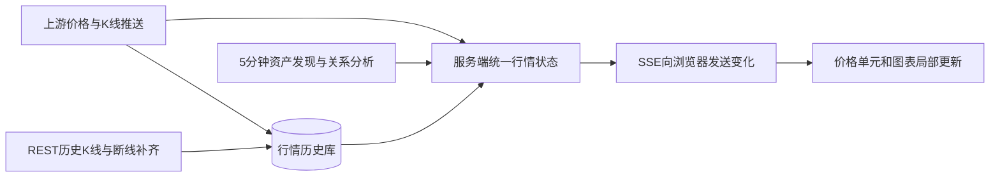

# 实时行情与图表改造调研

日期：2026-09-16。范围：当前代码、线上缓存快照、有限次数的上游接口实测及官方文档。本次没有修改或部署生产业务代码，没有开通付费套餐。

## 结论

采用“历史 K 线 + 实时行情推送 + 浏览器局部更新”。新币发现、关系分析继续低频运行；价格更新独立调度，所有链按用户关注度公平分配资源。先完成可用行情图及低成本更新，再开通有需要的推送权限。

现有 OKX Key 能取到分钟 K 线，但没有 WebSocket 订阅权限。币安 NVDABUSDT 已实测收到推送。真实股票的实时权限、覆盖市场和网站展示授权仍须按账户套餐核实；代币价、股票价和发行商参考价必须分别保留。

## 当前问题与证据

| 环节 | 当前情况 | 影响 |
|---|---|---|
| 全量任务 | dashboard 每轮完成后等待 300 秒 | 实际周期包含执行时间 |
| X Layer 行情 | liveQuotes 每轮完成后等待 90 秒，最多选 150 项 | 不是所有资产都每 90 秒更新 |
| 其他链行情 | sideQuotes 每 300 秒轮换 BSC 和 Robinhood 链 | 同一条链该任务间隔约 10 分钟以上 |
| 币安 | 30 秒轮询 REST 行情 | 已有条件改用推送 |
| Robinhood | 5 分钟读取资产与报价 | 参考报价不等同交易所逐笔成交价 |
| 浏览器 | 30 秒读取整份 dashboard；详情缓存 30 秒 | 上游更新后仍存在显示延迟 |
| 图表 | render 时销毁并重建 ECharts | 难以保持缩放、光标位置及连续更新 |
| 历史 | 每 5 分钟仅保留一个 price/cap 采样点，默认取 288 点 | 没有真实 OHLCV；连续采样时约 24 小时，不能充分支持 7 天图 |
| 顶部时间 | 部分渲染路径写入浏览器当前时间 | 页面刷新时间容易被理解为行情更新时间 |

代码入口：`src/server.ts`、`src/lib/xlayer.ts`、`src/lib/okx-client.ts`、`src/lib/research-store.ts`、`src/lib/bstocks.ts`、`src/lib/robinhood.ts`、`src/lib/market-enrichment.ts`、`public/app.js`、`public/radar-v2.js`。

16:14 北京时间线上候选资产快照共 529 项：BSC 196 项、X Layer 203 项、Robinhood 链 130 项。按 `fieldTimes.price` 计算，中位价格时间距观测时间分别约 8.3 分钟、139 分钟、2.7 分钟。这是单次候选资产快照，不代表全部股票或持续服务 SLA。旧时间可能涉及低交易活跃度、上游时间戳或调度覆盖，应进一步分类。

当时本地 OKX 计数为 4,850 / 8,000 次/日。这是应用本地限制，不是账户实际月度套餐余额。

## 上游实测

| 测试 | 结果 | 说明 |
|---|---|---|
| OKX WebSocket 登录 | code=0 | 当前凭据有效 |
| BSC AIN、X Layer XDOG、Robinhood 链 PONS：价格与 1 分钟 K 线订阅 | 六项均返回 60036，没有推送 | 上游原文：WebSocket access requires an active Market API subscription. |
| 上述三项 REST `/api/v6/dex/market/candles` | 三次均 HTTP 200、code=0，分别返回 5 根真实 1 分钟 K 线 | 含 OHLC、基础币成交量、美元成交额、未收盘标记；验证样本不代表所有资产覆盖 |
| Binance `nvdabusdt@miniTicker` | 20 秒观测收到 10 条消息 | 证实该 bStock 交易对可以推送；不代表每条消息都改变价格 |
| EODHD 美股推送 | 20 秒短探测没有取得可用于确认授权的响应或行情 | 不能据此判定账户支持或不支持；须继续核实权限及交易时段 |

OKX 文档显示 Free 不支持 WebSocket，Starter 为 99 美元/月并提供全部频道。价格频道在有效成交时推送，K 线频道最快每秒一次，不保证冷门资产每秒变价。[计费](https://web3.okx.com/onchainos/dev-docs/market/market-api-fee)、[价格频道](https://web3.okx.com/onchainos/dev-docs/market/websocket-price-channel)、[K 线频道](https://web3.okx.com/onchainos/dev-docs/market/websocket-candlesticks-channel)。

币安现货提供行情和 K 线推送，应以实际交易对为单位接入。币安交易所成交量不能作为同一代币的 DEX 成交量。[官方文档](https://developers.binance.com/en/docs/catalog/core-trading-spot-trading/api/ws-streams/~)。

项目调用的 EODHD `/api/real-time` 属于 Live Delayed 路线，官方对股票标注 15–20 分钟延迟；提高轮询频率不能消除源头延迟。真实推送需相应套餐，且市场覆盖不能一概而论。[EODHD 官方说明](https://eodhd.com/financial-apis/new-real-time-data-api-websockets)。

## 页面设计

详情页首屏优先展示“名称、最新价、涨跌、价格图和成交量”。AI 解读、关系解释、风险详情放在行情下方或侧栏。

```text
名称 / 代码       最新价   涨跌幅       加自选
行情状态         数据源   行情时间     股票交易时段
-------------------------------------------------
分时 / K线     1分  5分  15分  1小时  4小时  日线
主价格图：十字光标、缩放、拖拽、最新价格线
成交量副图
-------------------------------------------------
最新成交 / 相关股票与代币 / 风险与基本资料
```

- K 线更新当前未收盘柱；新周期才增加一根，不要每条消息都追加一根。
- 股票默认分时或日线，代币默认 5 分钟 K 线；时间尺度与可选区间分开，避免“1 分钟周期”和“最近 1 分钟”混淆。
- 列表加最新价、涨跌幅、迷你走势和行情状态。有真实价格变化时仅价格单元短暂着色，不闪整行。
- 名次变化暂缓重排，给出“榜单有更新”提示，避免用户正在点击时行位置跳走。
- 连接状态与最后成交时间分开。支持“实时推送、定时更新、延迟行情、休市、暂未取得行情”；无交易时价格静止是正常情况。
- 最新成交显示时间、买卖方向、价格、金额。AMM 资产没有真实订单簿时不显示仿造的买卖挂单。
- 股票、股票代币、相关 Meme 可同屏对比，但名称、价格性质和单位必须明确；跨资产图用相同时间轴和归一化涨跌幅，缺口不假装连续。

本次已核对 OKX 官方行情页面链接与行情接口；自动化浏览器未能取得完整交互图表，以上是建议设计，不是对 OKX 页面逐像素复刻的审查结果。

## 数据与更新架构



服务端合并所有用户的订阅，同一行情由一个共享采集通道分发。API Key 只留在服务端。前端首次先读快照，再衔接有序推送；断线重连补缺口，缓存不覆盖更新的行情。

统一结构至少保留 instrumentId、chainId、contract、venue、source、quoteType、currency、marketAt、receivedAt、delay/status。代币身份以链和合约区分，股票以市场和代码区分；同名不合并，来源变化不直接拼接 K 线。

新增 OHLCV 存储，唯一键包含资产、来源/市场、周期和开盘时间；保留 open/high/low/close、volume、volumeUsd、closed。按时间范围分页读取，避免固定 288 点造成 7 天视图缺数据。原有采样数据继续保留为采样线，不能反推为真实 K 线。K 线累计成交量更新时覆盖该柱的累计值，不能重复相加。

图表可先复用已有 ECharts 蜡烛图能力，关键是增量更新和真实数据；确需更接近专业行情交互时再评估 Lightweight Charts。换图表库本身不会带来实时行情。

## 额度安排

| 内容 | 建议目标 |
|---|---|
| 详情页、当前可见列表、自选 | 优先推送；没有权限时集中批量定时更新 |
| 后台候选价格 | 维持约 5 分钟扫描目标，在总预算内公平排队 |
| 24 小时统计、流动性 | 30 秒至 5 分钟，按源和额度分档 |
| 持有人、风险、关联分析 | 5–30 分钟或事件触发 |
| 资产目录与基本资料 | 低频刷新 |

REST 预算公式：每天请求约为 `86400 / 刷新秒数 × 批次数`，另加 K 线、分析和重试。一个批次每 30 秒就需要 2,880 次/日；三个批次需要 8,640 次/日，已经超过当前本地总上限。因此不能将全部资产一律改成 5 秒或 10 秒轮询。

应区分 Basic `/market/price` 与 Premium `/market/price-info`，高频任务只取必要价格，综合指标低频读取。额度按日和月统计，并为重试、历史补齐预留空间。推荐方案不会自动提高现有 5 分钟全量采集频率；价格快通道是需要明确配置预算的独立能力。

## 实施顺序与验收

1. 基础修正：分别展示行情时间、接收时间和连接状态；统一资产身份；去掉周期性整页销毁重建，保留筛选、语言和图表缩放。
2. 第一批可交付：接入实测可用的分钟 K 线、持久化和按区间读取；接入币安共享推送；其余保留标明频率的轮询。先覆盖详情及用户实际查看的资产。
3. 实时扩展：确认并开通需要的 OKX Market 订阅后接价格和 K 线频道；EODHD 按股票市场和账户权限接入。仍不具备实时源的资产显示延迟或定时行情。
4. 可靠性：自动重连、历史补齐、乱序丢弃或修正、未收盘柱覆盖、限额降级、服务重启恢复、隐藏标签页降频、所有链公平队列。

验收使用活跃标的：上游消息到达服务端后，目标 95% 在 2 秒内显示到前端（本系统延迟，不包括源头延迟）；价格和当前 K 线同步，更新不重置交互。另测无成交、休市、上游断线、额度耗尽、同名不同合约、多用户共享订阅以及中英文切换。图表与上游同来源同周期抽样核对 OHLCV；部署后观察完整交易时段与每日请求消耗，再扩大覆盖。
